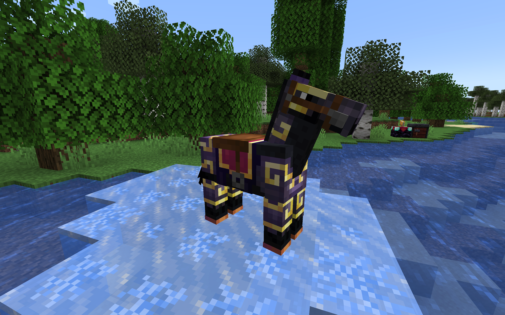

<!--suppress ALL -->

  

# Vanilla* Horses

Minecraft Fabric mod for horses as viable mode of transportation.

##  Overview

Horses are slow compared to endgame modes of transportation like elytras, and they are impractical
early- and midgame in face of common terrain features like forests and rivers. They are also very
outdated—except for breeding tweaks in 2023,
they’ve seen no meaningful improvements in their mechanics since their introduction in 2013.

This mod catches up horses to modern Minecraft and makes them a viable, competitive and pleasant
mode of transportation.

  

##  All Changes

### Horse Movement

- **Remove leaves collision** in certain cases for ridden horses (and other rideable animals)
- **Automatically leash horses** (and other rideable animals) when automatically dismounting underwater, if leads are in the
  player’s inventory
- Horses (and donkeys and mules) **swim faster** in water

### Horse Armor

- **Netherite horse armor**, crafted by upgrading diamond horse armor
- Support **enchanting** with all generic and armor-specific enchantments (e.g., Protection, Thorns)
- Support **trimming** with all armor trims
- Add **durability** according to its material
- Miscellaneous fixes for existing bugs:
  - [`MC-16829`](https://bugs.mojang.com/browse/MC-16829): The horse armor model does not show the
    enchantment glint effect
  - [`MC-275395`](https://bugs.mojang.com/browse/MC-275395): Some model parts of horse armor do not
    have a visible 0.1F cube deformation
  - [`MC-275574`](https://bugs.mojang.com/browse/MC-275574): Rendered horse armor textures are
    asymmetric

### Horseshoe

- Add **horseshoes**, crafted with copper ingots
- **Speeds up horses** (and donkeys and mules) when equipped in the new horseshoe slot
- Support **enchanting** with all generic and boots-specific enchantments (Depth Strider, Feather
  Falling, Frost Walker, Soul Speed)
- De-facto fixes for existing bugs:
  - [`MC-268935`](https://bugs.mojang.com/browse/MC-268935): The frost walker enchantment doesn’t
    function on horse armor
  - [`MC-268936`](https://bugs.mojang.com/browse/MC-268936): The soul speed enchantment doesn’t
    function on horse armor

##  Installation

### Requirements

As a Fabric mod, this mod requires the [Fabric Loader](https://fabricmc.net/). It also needs the
following dependencies:

<ul>
  <li>
     <a href="https://modrinth.com/mod/fabric-api">Fabric API</a>
  </li>
  <li>
     <a href="https://modrinth.com/mod/fabric-language-kotlin">Fabric Language Kotlin</a>
  </li>
</ul>
